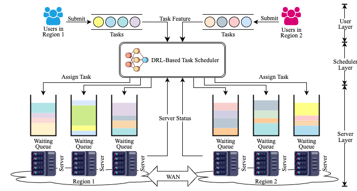
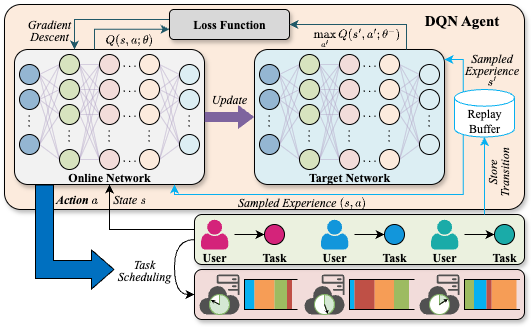

# Paper: Enabling Efficient Data-Intensive Task Scheduling in Geo-Distributed Clouds: A Deep Reinforcement Learning Approach

This is an implementation code for our paper entitled: *Enabling Efficient Data-Intensive Task Scheduling in Geo-Distributed Clouds: A Deep Reinforcement Learning Approach*

## Framework and DQN Training Process





## Requirements

```bash
# At the root directory of the project
git clone --branch v1.1.0 --depth 1 https://github.com/thu-ml/tianshou.git
cd tianshou
pip install poetry
poetry install
cd ..
pip install -r requirements.txt
```

## Configurations

The configurations are stored in directory `config`.

## Quick Start

```bash
python main.py
```

Directly run the `run.py`, the approach will run with the default settings.

## Code Structure

- `argument`: Modules related to argument parsing and analysis.
- `baseline`: Implementations of baseline scheduling algorithms.
- `cloudcomputing_env`: The environment for geo-distributed cloud computing task scheduling.
- `config`: Configuration files for servers and workload.
- `tools`: Utility functions for data processing.
